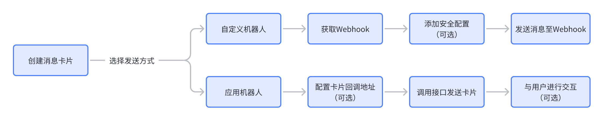
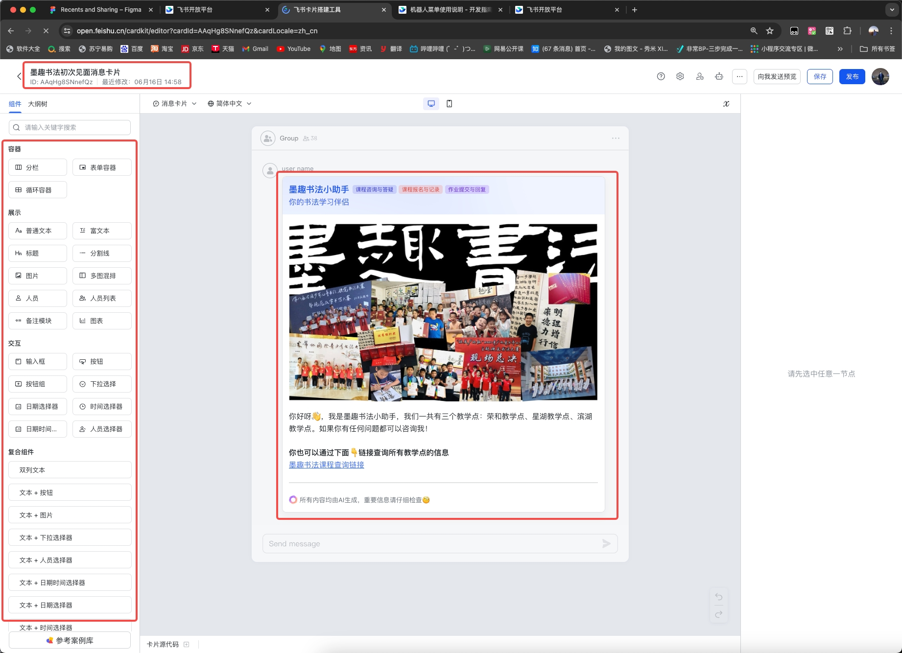

# 建立消息卡片
先在飞书开放平台上新建自定义消息卡片💳
地址如下：https://open.feishu.cn/cardkit

消息卡片的建立如图所示：


你需要记住消息卡片的ID，以墨趣书法的消息卡片为例，这个ID是：`AAqHg8SNnefQz`

你可以使用拖拽组件的方式来建立消息卡片，非常方便

# 如何打通消息卡片和Dify回调的回答
有很多朋友实现这个效果，就是将Dify的回答通过消息卡片的形式展现给用户，因为消息卡片样式自定义可以做的很美观，但是内容方面如何处理呢？
这里飞书其实做的很好！飞书在消息卡片中可以设置变量，所以你在调用消息卡片的时候，可以给其传入变量，实现卡片内容的赋予。
具体文档📄如下：
[发送消息卡片官方文档📄](https://open.feishu.cn/document/ukTMukTMukTM/uYzM3QjL2MzN04iNzcDN/send-message-card/send-message-using-card-id)

简单来说，消息卡片的发送你需要设置三个属性：
卡片ID、卡片名、卡片变量

参考如下：
```bash
FEISHU_CARD_TEMPLATES = '{
    "waiting_message_card": {                   # 消息卡片模板
        "template_id": "AAqHgvQHmb0Yp",         # 模板ID
        "template_variable": {                  # 模板变量

        }         
    },
    "reply_message_card": {                     # 消息卡片模板
        "template_id": "AAqHgxHLPqnHd",         # 模板ID
        "template_variable": {                  # 模板变量
            "answer": "", 
            "nextQ_A": "",
            "nextQ_B": "",
            "nextQ_C": "",
        }                 
    },
    "first_meeting_card": {                     # 消息卡片模板
        "template_id": "AAqHg8SNnefQz",         # 模板ID
        "template_variable": {}                 # 模板变量
    },
}'
```
# 如何使用消息卡片
接下来我将会介绍如何使用封装好的飞书消息卡片API，通过调用`FeishuAPI`类的`send_message`和`update_message`方法来发送和更新消息卡片。

### 发送消息卡片
通过调用`send_message`方法可以发送消息卡片。以下是方法的详细说明：

**方法签名**
```python
def send_message(self, receive_id_type, receive_id, content=None, card_template_name=None, template_variables=None):
```
**参数说明**
- receive_id_type：接收ID类型，可以是chat_id、open_id或user_id。
- receive_id：接收ID。
- content：消息内容（当未使用模板时）。
- card_template_name：卡片模板名称（可选）。
- template_variables：模板变量（可选）。
**示例代码**
```python
message_response = feishu_api.send_message(
    receive_id_type='chat_id',
    receive_id='oc_1234567890',
    content='Hello, this is a test message.',
    card_template_name='example_template',
    template_variables={'username': 'Alice'}
)
```
### 更新消息卡片
通过调用`update_message`方法可以更新已发送的消息卡片。以下是方法的详细说明：

**方法签名**
```python
def update_message(self, message_id, content=None, card_template_name=None, template_variables=None):
```

**参数说明**
- message_id：消息ID。
- content：新消息内容（当未使用模板时）。
- card_template_name：卡片模板名称（可选）。
- template_variables：模板变量（可选）。

**示例代码**
```python
update_response = feishu_api.update_message(
    message_id='om_9876543210',
    content='This is the updated message content.',
    card_template_name='example_template',
    template_variables={'username': 'Bob'}
)
```
**完整代码示例**

以下是完整的代码示例，展示了如何使用`send_message`和`update_message`方法：

```python
import requests
import json
import logging

logger = logging.getLogger(__name__)

class FeishuAPI:
    FEISHU_CARD_TEMPLATES = {
        'example_template': {
            'template_id': 'tpl_123456',
            'template_variable': {
                'username': 'default_user'
            }
        }
    }

    def get_access_token(self):
        url = "https://open.feishu.cn/open-apis/auth/v3/tenant_access_token/internal/"
        headers = {
            'Content-Type': 'application/json; charset=utf-8'
        }
        payload = {
            "app_id": "<your_app_id>",
            "app_secret": "<your_app_secret>"
        }
        response = requests.post(url, json=payload, headers=headers)
        access_token = response.json().get("tenant_access_token")
        return access_token

    def send_message(self, receive_id_type, receive_id, content=None, card_template_name=None, template_variables=None):
        access_token = self.get_access_token()

        if card_template_name:
            card_template = self.FEISHU_CARD_TEMPLATES.get(card_template_name)
            if not card_template:
                logger.warning(f"No card template found for name: {card_template_name}, using default message.")
                card_template_name = None
            else:
                if template_variables:
                    for key, value in template_variables.items():
                        card_template['template_variable'][key] = value
                
                card_content = {
                    "type": "template",
                    "data": {
                        "template_id": card_template["template_id"],
                        "template_variable": card_template["template_variable"]
                    }
                }
                payload_content = json.dumps(card_content)

        if not card_template_name:
            payload_content = json.dumps({
                "config": {
                    "wide_screen_mode": True
                },
                "elements": [
                    {
                        "tag": "div",
                        "text": {
                            "content": f"I received your message: {content}",
                            "tag": "lark_md"
                        }
                    }
                ]
            })

        url = f'https://open.feishu.cn/open-apis/im/v1/messages?receive_id_type={receive_id_type}'
        headers = {
            'Authorization': f'Bearer {access_token}',
            'Content-Type': 'application/json; charset=utf-8'
        }
        payload = {
            'receive_id': receive_id,
            'msg_type': 'interactive',
            'content': payload_content
        }

        response = requests.post(url, json=payload, headers=headers)
        print(f"Send Message Card response: {response.text}")
        return response.json()

    def update_message(self, message_id, content=None, card_template_name=None, template_variables=None):
        access_token = self.get_access_token()
        try:
            if card_template_name:
                card_template = self.FEISHU_CARD_TEMPLATES.get(card_template_name)
                if not card_template:
                    logger.warning(f"No card template found for name: {card_template_name}, using default message.")
                    card_template_name = None
                else:
                    if template_variables:
                        for key, value in template_variables.items():
                            card_template['template_variable'][key] = value
                    
                    card_content = {
                        "type": "template",
                        "data": {
                            "template_id": card_template["template_id"],
                            "template_variable": card_template["template_variable"]
                        }
                    }
                    payload_content = json.dumps(card_content)
        except Exception as e:
            logger.error(f"Error: missing key {e}") 

        if not card_template_name:
            payload_content = json.dumps({
                "config": {
                    "wide_screen_mode": True
                },
                "elements": [
                    {
                        "tag": "div",
                        "text": {
                            "content": f"This is my answer: {content}",
                            "tag": "lark_md"
                        }
                    }
                ]
            })

        url = f'https://open.feishu.cn/open-apis/im/v1/messages/{message_id}'
        headers = {
            'Authorization': f'Bearer {access_token}',
            'Content-Type': 'application/json; charset=utf-8'
        }
        payload = {
            'content': payload_content
        }
        response = requests.patch(url, json=payload, headers=headers)
        print(f"Update Message Card response: {response.text}")
        try:
            return response.json()
        except requests.exceptions.JSONDecodeError:
            print("Failed to decode JSON response")
            return response.text

# 实例化FeishuAPI并发送消息
feishu_api = FeishuAPI()

message_response = feishu_api.send_message(
    receive_id_type='chat_id',
    receive_id='oc_1234567890',
    content='Hello, this is a test message.',
    card_template_name='example_template',
    template_variables={'username': 'Alice'}
)

# 更新消息
update_response = feishu_api.update_message(
    message_id='om_9876543210',
    content='This is the updated message content.',
    card_template_name='example_template',
    template_variables={'username': 'Bob'}
)
```
以上是封装好的飞书消息卡片API的详细使用说明。通过这些方法，用户可以方便地发送和更新飞书消息卡片。希望这些信息对你有帮助！